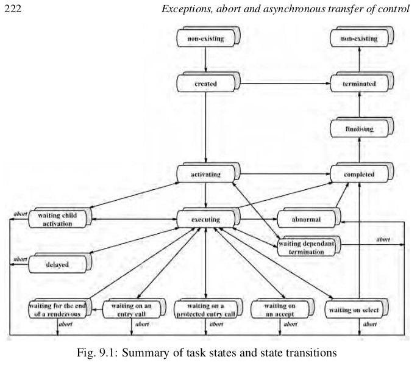

Ada-concurrency (Ada Tasking Model)

# Process 
In computing, a process is the instance of a computer program that is being executed by one or many threads. 

# Thread
A thread of execution is the smallest sequence of programmed instructions that can be managed independently by a scheduler, which is typically a part of the operating system. The implementation of threads and processes differs between operating systems, but in most cases a thread is a component of a process. Multiple threads can exist within one process, with the threads executing concurrently.

# Parallelism
Two processes are said to be executing in parallel if at any instant they are both executing.  

# Concurrency
Two processes are said to be concurrent if they have the potential for executing in parallel.

# Real-time
A system is real-time if its specification has time-dependent features.

Real time systems are defined as those systems in which the correctness of the system depends not only on the logical result of computation, but also on the time at which the results are produced.

# Task 
Ada provides for the direct programming of parallel activities. Within an Ada program there may be a number of tasks, each of which has its own thread of control. Each individual thread of control within a concurrent program is known as a process, although Ada uses the term task.

# Ada Tasking Model

# Deadlines

(1) A deadline is usually defined to be absolute if it refers to a specific (future) point in time.

(2) A relative deadline is one that is anchored to the current time.

(3) If the current time is known then a relative deadline can be translated into an absolute one. 

It is an anomaly that Ada’s support for real-time does not extend as far as 
havinga direct representation for ‘deadline’, but the task attribute features 
or equivalent doesallow a deadline attribute to be assigned. 

The following gives a suitable package for the support of deadlines.

-- =======================================================

with Ada.Task_Identification; 

use  Ada.Task_Identification;

with Ada.Real_Time;

package Ada.Deadlines is

	subtype Deadline is Ada.Real_Time.Time;
	
	Default_Deadline : constant Deadline := Ada.Real_Time.Time_Last;
	
	procedure Set_Absolute_Deadline(D : Deadline;T : Task_ID := Current_Task);
	
	procedure Set_Relative_Deadline(R : Ada.Real_Time.Time_Unit; T : Task_ID := Current_Task);
	
	function Get_Deadline(T : Task_ID := Current_Task);
	
-- ========================================================	
